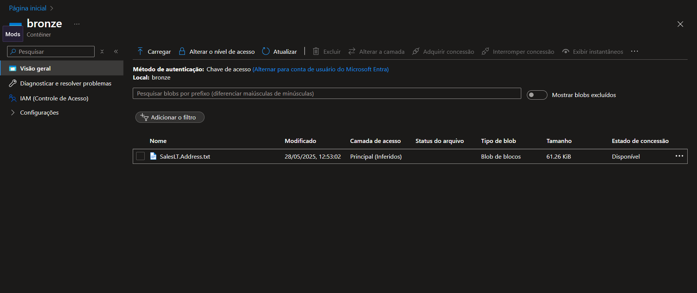

# redundancia-de-arquivos-azure
Projeto DIO - Azure Data Factory transferindo dados do Azure SQL para Blob Storage

# 🚀 Projeto: Transferência de Dados SQL para Blob Storage com Azure Data Factory

Este projeto foi desenvolvido como parte do desafio prático da DIO, onde realizamos a integração de um banco de dados SQL no Azure com um Armazenamento de Blob do Azure usando pipelines do Data Factory.

## 📌 Objetivo
Transferir dados de um banco SQL hospedado no Azure para um Blob Storage, utilizando os recursos de:
- Azure SQL Database
- Azure Blob Storage
- Azure Data Factory (ADF)

## 📁 Estrutura do repositório
- `dataset/`: Definições dos datasets usados nas conexões
- `factory/`: Metadados da instância do Data Factory
- `integrationRuntime/`: Configuração do runtime de integração
- `linkedService/`: Serviços vinculados (SQL Server, Blob)
- `pipeline/`: Pipeline criado no ADF para realizar a cópia de dados

## 🛠️ Processos
1. Criado um banco de dados SQL com autenticação SQL
2. Criado uma conta de armazenamento Blob no Azure
3. Configurado serviços vinculados no ADF para o banco e Blob
4. Criado pipeline com atividade de cópia de dados
5. Executado e validado com sucesso 

## 📷 Prints
### ✔️ Detalhes da atividade de cópia entre SQL Server e Blob Storage:

### ✔️ Conteúdo do container “bronze” no Azure Blob Storage:

## 🤖 Insights
- Aprendi como configurar autenticação no SQL Server e criar usuários com permissões adequadas
- Entendi a importância de configurar regras de firewall no servidor
- Experimentei a exportação de recursos do Data Factory para Git

